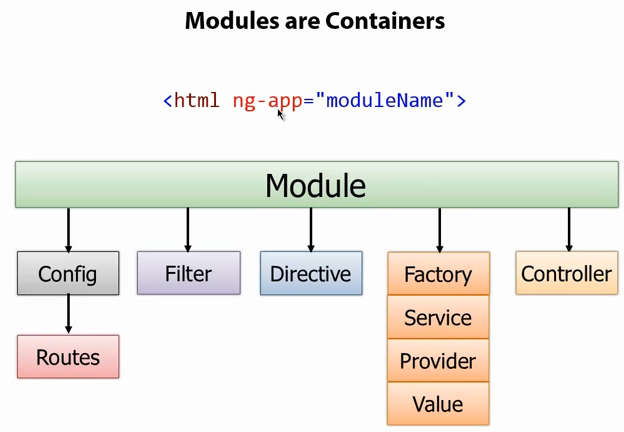
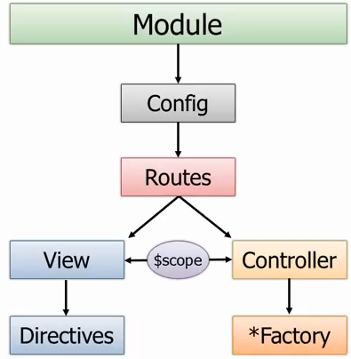
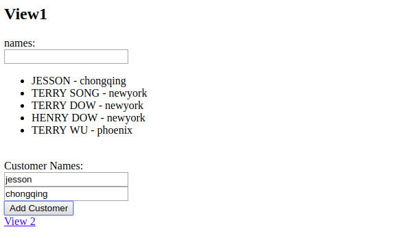
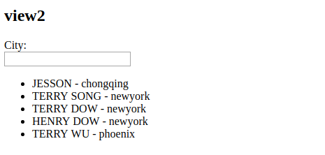

### AngularJS基础
基于油管上的一个AngularJS入门教程：[Angular入门](https://www.youtube.com/watch?v=i9MHigUZKEM&feature=youtu.be),主要讲解AngularJS中的**Directive**,**Data Binding**,**Filter**和**Module**的概念和用法。[原文链接](https://www.cnblogs.com/1zhk/p/5348391.html)

#### Directive 和 Data Binding
抛弃了以往的给元素设置ID的方式操作DOM，AngularJS使用Declarative来“指导”HTML元素行为。

下面代码使用了两个Directive: ng-app 和 ng-model

ng-app: 用于auto-bootstrap一个ng应用。这是必需的一个Directive,一般加在HTML的根目录上。
ngModel: 用于在property和HTML控件之间建立双向的Data Binding。

``` html
<!DOCTYPE html>
<html ng-app="">
<head>
    <title>Using Directives and Data Binding Syntax</title>
</head>
<body>
<div class="container">
    Name: <input type="text" ng-model="name" /> {{name}}
</div>
<script src="angular-1.5.8/angular.min.js"></script>
</body>
</html>
```
值得注意的是：在`<html>`标签里面有`data-ng-app=""`这十分重要。

Directive可以使用"x-"或者"data-"作为前缀，Directive可以放置于元素名、属性、class、注释中。

```html
<!DOCTYPE html>
<html data-ng-app="">
<head>
    <title>Using Directives and Data Binding Syntax</title>
</head>
<body>
    <div class="container">
        Name: <input type="text" data-ng-model="name" /> {{name}}
    </div>
    <script src="angular.min.js"></script>
</body>
</html>
```
使用**ng-init**和**ng-repeat**来遍历操作一个数组：

``` html
<!DOCTYPE html>
<html data-ng-app="">
<head>
    <title>Iterating with the ng-repeat Directive</title>
</head>
<body>
    <div class="container" data-ng-init="names = ['Terry','William','Robert','Henry']">
        <h3>Looping with the ng-repeat Directive</h3>
        <ul>
            <li data-ng-repeat="name in names">{{name}}</li>
        </ul>
    </div>
    <script src="angular.min.js"></script>
</body>
</html>
```

#### Filter

作用是接受一个输入，通过某个规则进行处理，返回处理后的结果。主要是对于数组过滤，对数组中的元素进行排序，对数据做格式化处理等。

AngularJS内置了一些过滤器，他们是： currency(货币)、date(日期)、filter(子串匹配)、json(格式化json对象)、limitTo(限制个数)、lowercase(小写)、uppercase(大写)、number(数字)、orderBy(排序)。总共九种。而且支持自定义过滤器。

``` html
<!DOCTYPE html>
<html data-ng-app="">
<head>
    <title>Using Filter</title>
</head>
<body>
    <div class="container" data-ng-init="customers = [{name:'Terry Wu',city:'Phoenix'},
         {name:'Terry Song',city:'NewYork'},{name:'Terry Dow',city:'NewYork'},
         {name:'Henry Dow',city:'NewYork'}]">
        Names:
        <br />
        <input type="text" data-ng-model="name" />
        <br />
        <ul>
            <li data-ng-repeat="cust in customers | filter:name | orderBy:'city'">{{cust.name | uppercase}} - {{cust.city | lowercase}}</li>
        </ul>
    </div>
    <script src="angular.min.js"></script>
</body>
</html>
```

#### Module
Module就是一个容器，用于管理一个AngularJS应用的各个部分，也许跟VUE中的template类似。一个独立的AngularJS功能模块可以封装成一个Module。

下图是一个Module由哪些常见部分组成。
- Config/Route: 用于配置AngularJS应用的路由(AngularJS)
- Filter: 对数据起过滤作用
- Directive: 扩展HTML,AngularJS中最重要的概念。
- Controller: MVC模式中常见的控制器，两个作用：实现页面上的业务逻辑，以及对$scope(model)进行操作。
- Factory/Service/Provider/Value: 提供方法供Controller使用。大多数时候通过它们实现对数据源的访问，以及实现一些通用的逻辑以在不同的Controller中共享。比如Restful API就是常见的数据源。



实际工程中使用的是以下的方法。

``` html
<!DOCTYPE html>
<html data-ng-app="demoApp">
<head>
    <title>Using  module Controller</title>
</head>
<body>
<div data-ng-controller="SimpleController">
    Names:
    <br />
    <input type="text" data-ng-model="name" />
    <br />
    <ul>
        <li data-ng-repeat="cust in customers | filter:name | orderBy:'city'">{{cust.name | uppercase}} - {{cust.city | lowercase}}</li>
    </ul>
</div>

<script src="../angular-1.5.8/angular.min.js"></script>

<script>
    var demoApp = angular.module("demoApp", []);

    // 第一种方法
    /*demoApp.controller("SimpleController", function ($scope) {
        $scope.customers = [
            { name: 'Terry Wu', city: 'Phoenix' },
            { name: 'Terry Song', city: 'NewYork' },
            { name: 'Terry Dow', city: 'NewYork' },
            { name: 'Henry Dow', city: 'NewYork' }
        ];
    });*/

    // 第二种方法
    var controllers = {};
    controllers.SimpleController = function ($scope) {
        $scope.customers = [
            { name: 'Terry Wu', city: 'Phoenix' },
            { name: 'Terry Song', city: 'NewYork' },
            { name: 'Terry Dow', city: 'NewYork' },
            { name: 'Henry Dow', city: 'NewYork' }
        ];
    };

    demoApp.controller(controllers);
</script>
</body>

</html>
```
第三种方式：

``` html
<!DOCTYPE html>
<html data-ng-app="demoApp">
<head>
    <title>Using Controller</title>
</head>
<body>
    <div>
        <div data-ng-view=""></div>
    </div>

    <script src="angular.min.js"></script>
    <script src="angular-route.min.js"></script>

    <script>
        var demoApp = angular.module('demoApp', ['ngRoute']);

        demoApp.config(function ($routeProvider) {
            $routeProvider
                .when('/',
                {
                    controller: 'SimpleController',
                    templateUrl: 'Partials/View1.html'
                })
                .when('/view2',
                {
                    controller: 'SimpleController',
                    templateUrl: 'Partials/View2.html'
                })
                .otherwise({redirectTo:'/'});
        });

        var controllers = {};
        controllers.SimpleController = function ($scope) {
            $scope.customers = [
                { name: 'Terry Wu', city: 'Phoenix' },
                { name: 'Terry Song', city: 'NewYork' },
                { name: 'Terry Dow', city: 'NewYork' },
                { name: 'Henry Dow', city: 'NewYork' }
            ];

            $scope.addCustomer = function () {
                $scope.customers.push({ name: $scope.newCustomer.name, city: $scope.newCustomer.city });
            };
        }

        demoApp.controller(controllers);
    </script>
</body>

</html>
```
下图展示了Module及其各个组成部分的关系。



路由配置关键代码：

``` js
demoApp.config(function ($routeProvider) {
    $routeProvider
        .when('/',
            {
                controller: 'SimpleController',
                templateUrl: 'view1.html'
            })
        .when('/view2',
            {
                controller: 'SimpleController',
                templateUrl: 'view2.html'
            })
        .otherwise({redirectTo: '/'});
});
```

效果如下：






下面一个实例更接近实际工程中的用法，引入了Factory来初始化数据（实际工程中，在这里可以访问webAPI获取数据完成初始化），Controller中则通过Factory获得数据。

``` html
<!DOCTYPE html>
<html lang="en" ng-app="demoApp">
<head>
    <meta charset="UTF-8">
    <title>使用工厂</title>
    <script src="../angular-1.5.8/angular.js"></script>
    <script src="../angular-1.5.8/angular-route.js"></script>
</head>
<body>
<div>
    <div data-ng-view=""></div>
</div>
</body>
<script>
    let demoApp = angular.module('demoApp', ['ngRoute']);

    demoApp.config(function ($routeProvider) {
        $routeProvider
            .when('/',
                {
                    controller: 'SimpleController',
                    templateUrl: 'view1.html'
                })
            .when('/view2',
                {
                    controller: 'SimpleController',
                    templateUrl: 'view2.html'
                })
            .otherwise({ redirecTo: '/' });
    });

    // 所有的数据放在factory里面，进行组装处理
    demoApp.factory('simpleFactory', function () {
        let customers = [
            { name: 'Terry Wu', city: 'Phoenix' },
            { name: 'Terry Song', city: 'NewYork' },
            { name: 'Terry Dow', city: 'NewYork' },
            { name: 'Henry Dow', city: 'NewYork' }
        ];

        let factory = {};

        factory.getCustomers = function () {
            return customers;
        };

        return factory;
    });

    let controllers = {};
    controllers.SimpleController = function ($scope, simpleFactory) {
        $scope.customers = [];

        init();

        function init() {
            $scope.customers = simpleFactory.getCustomers();    // 赋值
        }

        $scope.addCustomer = function () {
            $scope.customers.push({name: $scope.newCustomer.name, city: $scope.newCustomer.city});
        }
    };

    demoApp.controller(controllers);
</script>
</html>
```
