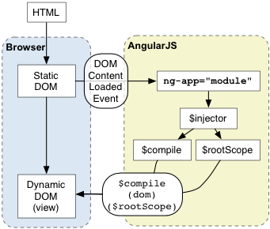
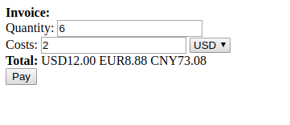
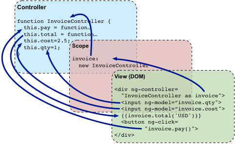
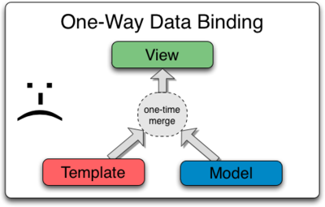
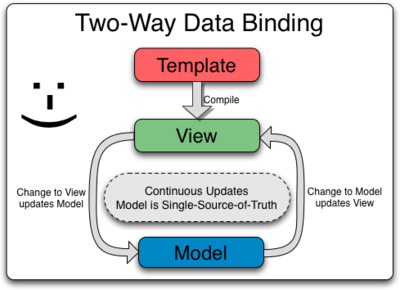

# AngularJS教程
AngularJS诞生于2009年，它有着诸多特性，最为核心的是：MVVM、模块化、自动化双向数据绑定、语义化标签、依赖注入等等。

#### 快速过一遍
如果想迅速熟悉AngularJS的工作流程，可以先参考官方给出的开发示例。

[学习PhoneCat](http://www.angularjs.net.cn/phonecat/)

#### 查看AngularJS Api
AngularJS提供了很多功能丰富的组件，处理核心的ng组件外，还扩展了很多常用的功能组件，如`ngRoute(路由)`,`ngAnimate(动画)`,`ngTouch(移动端操作)`等。
- ng
- ngRoute
- ngAnimate
- ngAria
- ngResource
- ngCookies
- ngTouch
- ngSanitize
- ngMock

### AngularJS简介(Introduction)

AngularJS是一个开发动态web应用的框架。它可以使用HTML作为模板语法并且可以通过扩展的html语法来使应用组件更加清晰和简洁。Angular使html具备了构建动态web应用的能力。

通常，我们通过以下手段来解决动态应用和静态文档之间不匹配的问题：
- **类库：** 一些在开发WEB应用时非常有用的函数集合。如：`jQuery`等。
- **框架：** 一种WEB应用的特殊实现，如：`knockout`,`ember`等。

Angular另辟蹊径，它通过指令(directive)扩展HTML的语法。如：
- 通过`{{}}`进行数据绑定。
- 使用DOM控制结构来进行迭代或隐藏DOM片段。
- 支持表单和表单验证。
- 将逻辑代码关联到DOM元素上。
- 将一组HTML做成可重用的组件。

Angular适用于构建CRUD(增、删、改、查)应用。

Angular的一些出众之处：
- 构建一个CRUD应用时可能用到的所有技术：数据绑定、基本模板指令、表单验证、路由、深度链接、组件重用、以来注入。
- 可测试性：单元测试、端到端测试、模拟对象(mocks)、测试工具。
- 拥有一定目录结构和测试脚本的种子应用。种子。。。。。

#### Angular之道

Angular是建立在这样的信念之上的：即声明式的代码用在构建用户界面和组装软件时更好，而命令式的代码更擅长展现业务逻辑。
- 将应用逻辑与DOM操作解偶，会大大提高代码的可测试性。
- 平等看待应用的测试和开发，测试的难度很大程度上取决于代码的结构。
- 将前端与服务器端解偶，这样使得前端的开发和服务器端的开发可以齐头并进，实现两边代码的重用。(表示无法理解)
- 框架在整个应用的开发流程中知道开发者：从用户界面设计到实现业务逻辑，再到测试。
- 化繁为简，化整为零总是好的。

Angular将我们从下面的苦海中解脱出来：(???)
- **使用回调：** 回调会降低代码的可读性，使代码变得零散。移除像回调之类的常见代码是件好事，大幅移除因为JavaScript者们语言的不足而使得我们不得不写的代码，从而让应用显得清晰。
- **以编程的方式操作HTML DOM：** 操作HTML DOM是AJAX应用中很基础的一部分，但它不灵活而且容易出错。通过声明式的语句，描诉UI该怎样随着状态的改变而变化，能让你从低级的DOM操作中解脱出来。绝大多数Angular的应用开发中，开发者都不需要自己去写低级的操作DOM的代码，如果非要这样做，也是可以的。
- **在用户界面中读写数据：** AJAX应用中的绝大多数操作都是CRUD操作。一个典型的流程是从服务器端读取到数据组装成内部对象，然后讲述据重新组装成内部对象，在发给服务器。在这个流程中有很多重复的代码要写，而Angular消除了这个流程中几乎所有的重复代码，使得代码看起来只是在描诉所有的执行流程，而不是所有的实现细节。
- **在开始前大量的初始化代码：** 一般需要些很多的基础性的代码才能完成一个基本的AJAX的Hello World应用。在Angular的应用中，可以通过一些服务来初始化应用，这些服务都是类似与Guice的方式进行以来注入的。这回让我们很快进入功能开发。另外，还能完全控制自动化测试的初始化过程。

### AngularJS引导程序(Bootstrap)

这一章讲述Angular初始化过程以及必要的时候用户如何能够手动将Angular初始化。

#### Angular `<script>` 标签

就跟其他的导入javascript脚本方式一样。

如果想要应用自动启动Angular的话，就要把 `ng-app` 放在应用的根节点

``` html
<html ng-app>
```

如果应用需要支持IE7，那么就要加上`id="ng-app"`

``` html
<html ng-app id="ng-app">
```

#### 自动初始化

Abgular在以下两种情况下自动初始化，一个是在`DOMContentLoaded`事件触发时，或者在`angular.js`脚本被执行的同时如果`document.readyState`被置为`'complete'`的话。



初始化时，Angular回去找`ng-app`这个指明应用开始所在的指令。如果`ng-app`指令被找到的话，Angular会做以下几件事：
- 加载`ng-app`指令所指定的模块
- 创建应用所需的`injector`
- 以`ng-app`所在的节点为根节点，开始遍历并编译DOM树(`ng-app`指出了应用的哪一部分开始时Angular去编译的)。

#### 手动初始化

如果想要在初始化阶段拥有更多的控制权，可以使用手动方法启动应用。

下面是一个手动初始化Angular的例子：

``` js
angular.element(document).ready(function () {
  angular.module('myApp', []);
  angular.bootstrap(document, ['myApp']);
});
```

在上面例子中，我们提供了我们应用要加载的模块名作为`api/angular.bootstrap`函数的第二个参数。需要注意的是`angular.bootstrap`不会凭空创建模块，在我们将模块作为参数注入之前，必须创建任一自定义的模块。

Angular代码运行时遵循的顺序：
1. 在HTML页面以及所有代码加载完毕后，Angular回去找到应用的根元素(通常是文档的根节点).
2. 调用`api/angular.bootstrap`去编译各元素成为一个可执行的且双向绑定的应用。

#### 延迟启动

这个特色可以让像Batarang一样的测试工具横插一杠进入Angular的引导进程。

当`api/angular.bootstrap`被调用时，如果`window.name`包含`NG_DEFER_BOOTSTRAP!`前缀，引导进程会被暂停直到`angular.resumeBootstrap()`被调用。
`angular.resumeBootstrap()`以一个可选的数组作为参数，这个数组是包含了应用启动时需要被注入的模块。

### AngularJS概念概述(Conceptual OverView)

| 概念                           | 说明                                                                                     |
| ------------------------------ | ---------------------------------------------------------------------------------------- |
| 模板(templateUrl)              | 带有Angular扩展标记的HTML                                                                |
| 指令(Directives)               | 用于通过自定义属性和元素扩展HTML的行为                                                   |
| 模型(model)                    | 用于显示给用户并且与用户互动的数据                                                       |
| 作用域(scope)                  | 用来存储模型(Model)的语境(context)。模型放在这个语境中才能被控制器、指令和表达式等访问到 |
| 表达式(Expression)             | 模板中可以通过它来访问作用于(Scope)中的变量和函数                                        |
| 编译器(Compiler)               | 用来编译模板(Template),并且对其中包含的指令(Directive)和表达式(Expression)进行实例化     |
| 过滤器(filter)                 | 负责格式化表达式(Expression)的值，以便呈现给用户                                         |
| 视图(View)                     | 用户看到的内容(就是DOM)                                                                  |
| 数据绑定(Data Binding)         | 自动同步模型(Model)中的数据和视图(View)表现                                              |
| 控制器(Controller)             | 视图(View)背后的业务逻辑                                                                 |
| 依赖注入(Dependency Injection) | 负责创建和自动装载对象或函数                                                             |
| 注入器(injector)               | 用来实现依赖注入(Injection)的容器                                                        |
| 模块(Module)                   | 用来配置注入器                                                                           |
| 服务(Service)                  | 独立于视图(View)的、可复用的业务逻辑                                                     |

#### 数据绑定

``` html
数量：<input type="text" ng-model="qty" required>
<b>总价：{{qty}}</b>
```

第一类是指令(directive)

第二类新标记是双大括号`{{ expression | filter }}`,其中expression是表达式语句，filter是过滤器语句。

Angular提供了动态(live)的绑定：当input元素的值变化的时候，表达式的值也会自动重新计算，并且DOM所呈现的内容也会随着这些值的变化而自动更新。这种模型(model)与视图(view)的联动就叫做"双向数据绑定"。

#### 添加UI逻辑：控制器

``` html
<!DOCTYPE html>
<html lang="en">
<head>
    <meta charset="UTF-8">
    <title>Title</title>
    <script src="../angular-1.5.8/angular.js"></script>
</head>
<body>
<div ng-app="invoice1" ng-controller="InvoiceController as invoice">
    <b>Invoice:</b>
    <div>
        Quantity: <input type="number" min="0" ng-model="invoice.qty" required>
    </div>
    <div>
        Costs: <input type="number" min="0" ng-model="invoice.cost" required>
        <select ng-model="invoice.inCurr">
            <option ng-repeat="c in invoice.currencies">{{c}}</option>
        </select>
    </div>
    <div>
        <b>Total:</b>
        /* 注意currency过滤器后面跟的是冒号： */
        <span ng-repeat="c in invoice.currencies">
            {{invoice.total(c) | currency:c}}
        </span><br>
        <button class="btn" ng-click="invoice.pay()">Pay</button>
    </div>
</div>
</body>
<script>
    angular.module('invoice1', [])
        .controller('InvoiceController', function InvoiceController() {
            this.qty = 1;
            this.cost = 2;
            this.inCurr = 'CNY';
            this.currencies = ['USD', 'EUR', 'CNY'];
            this.usdToForeignRates = {
                USD: 1,
                EUR: 0.74,
                CNY: 6.09
            };

            this.total = function total(outCurr) {
                return this.convertCurrency(this.qty * this.cost, this.inCurr, outCurr);
            };
            this.convertCurrency = function convertCurrency(amount, inCurr, outCurr) {
                return amount * this.usdToForeignRates[outCurr] / this.usdToForeignRates[inCurr];
            };
            this.pay = function pay() {
                window.alert('Thanks!');
            };
        });
</script>
</html>
```



在javascript标签中，在这里，定义了一个被称为“控制器(controller)”的函数。控制器的用途是导出一些变量和函数，供模板的表达式(expression)和指令(directive)使用。

在创建一个控制器的同时，我们还往HTML中添加了一个`ng-controller`指令。这个指令告诉Angular,我们创建的这个`InvoiceController`控制器将会负责管理这个带有ng-controller指令的div节点，及其各级子节点。`InvoiceController as invoice`这个语法告诉Angular:创建这个`InvoiceController`的实例，并且把这个实例赋值给当前作用域(Scope)中的`invoice`变量。

同时，我们修改了页面中所有用于读写Scope变量的表达式，给他们加上了一个`invoice.`前缀。

在这个script标签中，我们还创建了一个模块(module),并且在这个模块中注册了控制器(controller)。

下图表现的是我们生命了这个控制器(controller)之后，它们是如何协作的。



#### 与视图(View)无关的业务逻辑：服务(Service)

现在，`InvoiceController`包含了我们这个例子中的所有逻辑。如果这个应用程序的规模继续成长，最好的方法是：把控制器中与视图无关的逻辑都移到“服务(service)”中。以便这个应用程序的其他部分也能复用这些逻辑。

重构例子，把币种兑换的逻辑移入到一个独立的服务(service)中。

``` html
<!DOCTYPE html>
<html lang="en">
<head>
    <meta charset="UTF-8">
    <title>Title</title>
    <script src="../angular-1.5.8/angular.js"></script>
    <script src="../js/finance.js"></script>
    <script src="../js/invoice.js"></script>
</head>
<body>
<div ng-app="invoice" ng-controller="InvoiceController as invoice">
    <b>Invoice:</b>
    <div>
        Quantity: <input type="number" min="0" ng-model="invoice.qty" required>
    </div>
    <div>
        Costs: <input type="number" min="0" ng-model="invoice.cost" required>
        <select ng-model="invoice.inCurr">
            <option ng-repeat="c in invoice.currencies">{{c}}</option>
        </select>
    </div>
    <div>
        <b>Total:</b>
        <span ng-repeat="c in invoice.currencies">
            {{invoice.total(c) | currency:c}}
        </span><br>
        <button class="btn" ng-click="invoice.pay()">Pay</button>
    </div>
</div>
</body>
</html>
```

``` js
angular.module('invoice', ['finance'])
    .controller('InvoiceController', ['currencyConverter', function (currencyConverter) {
        this.qty = 1;
        this.cost = 2;
        this.inCurr = 'EUR';
        this.currencies = currencyConverter.currencies;

        this.total = function (outCurr) {
            return currencyConverter.convert(this.qty * this.cost, this.inCurr, outCurr);
        };

        this.pay = function () {
            window.alert('谢谢！！');
        }
    }]);
```

``` js
angular.module('finance', [])
    .factory('currencyConverter', function () {
       let currencies = ['USD', 'EUR', 'CNY'],
           usdToForeignRates = {
               USD: 1,
               EUR:0.74,
               CNY: 6.09
           };
       return {
           currencies: currencies,
           convert: convert
       };

       function convert(amount, inCurr, outCurr) {
           return amount * usdToForeignRates[outCurr] / usdToForeignRates[inCurr];
       }
    });
```

我们把`convertCurrency`函数所支持的币种的定义独立到一个新文件：finance.js。

我们通过"依赖注入(Dependency Injection)"的方式找到这个独立的函数。依赖注入(DI)是一种设计模式(Design Pattern),它用于解决下列问题：我们创建了对象和函数，但是它们怎么得到自己所依赖的对象。

Angular中的每一样东西都是用依赖注入的方式来创建和使用的，比如指令、过滤器、控制器、服务。在Angular中，依赖注入的容器叫做"注入器"。

要进行依赖注入，必须先把这些需要协同工作的对象和函数注册(Register)到某个地方。在Angular中，这个地方叫模块。

前面一个例子中：模板包含了一个`ng-app="invoice"`指令。这告诉Angular使用invoice模块作为该应用程序的主模块。`angular.module('invoice', ['finance'])`表示：`invoice`模块依赖于`finance`模块。这样一来，Angular就能同时使用`InvoiceController`这个控制器和`currencyConverter`这个服务了。

`InvoiceController`该怎样获得这个`currencyConverter`函数的引用，在Angular中,这非常简单，只要在构造函数中定义一些具有特定名字的参数就可以了。这时，注入器就可以按照正确的依赖关系创建这些对象，并且根据名字把它们传入那些依赖它们的对象工厂中。在前面的代码中，`InvoiceController`有一个叫`currencyConverter`的参数。根据这个参数，Angular就知道`InvoiceController`依赖于`currencyConverter`,取得`currencyConverter`服务的俄实例，并且把它作为参数传给`InvoiceController`的构造函数。

最后一点是我们把一个数组作为参数传入到`module.controller`函数中，而不再是一个普通的函数。这个数组前面部分的元素包含这个控制器所依赖的一系列服务的名字，最后一个元素则是这个控制器的构造函数。这样做的用处是：避免js代码压缩器(Minifier)破坏这个“依赖注入”的过程。

#### 访问后端

通过Yahoo finance API来获取货币之间的当前汇率。

``` js
angular.module('finance', [])
    .factory('currencyConverter', ['$http', function($http) {
        var YAHOO_FINANCE_URL_PATTERN =
            'http://query.yahooapis.com/v1/public/yql?q=select * from '+
            'yahoo.finance.xchange where pair in ("PAIRS")&format=json&'+
            'env=store://datatables.org/alltableswithkeys&callback=JSON_CALLBACK',
            currencies = ['USD', 'EUR', 'CNY'],
            usdToForeignRates = {};
        refresh();
        return {
            currencies: currencies,
            convert: convert,
            refresh: refresh
        };

        function convert(amount, inCurr, outCurr) {
            return amount * usdToForeignRates[outCurr] * 1 / usdToForeignRates[inCurr];
        }

        function refresh() {
            var url = YAHOO_FINANCE_URL_PATTERN.
            replace('PAIRS', 'USD' + currencies.join('","USD'));
            return $http.jsonp(url).success(function(data) {
                console.log(data);
                var newUsdToForeignRates = {};
                angular.forEach(data.query.results.rate, function(rate) {
                    var currency = rate.id.substring(3,6);
                    newUsdToForeignRates[currency] = window.parseFloat(rate.Rate);
                });
                usdToForeignRates = newUsdToForeignRates;
            });
        }
    }]);
```

这次我们的`finance`模块中的`currencyConverter`服务使用了`$http`服务--它是由Angular内建的用于访问后端的API服务。是对`XMLHttpRequest`以及JSONP的封装。详情参考\$http的API文档-[\$http](http://www.angularjs.net.cn/api/105.html)。

### AngularJS Html编译(HTML Compiler)

Angular的`HTML compiler`让开发者可以教浏览器一些新的语法技能。编译器允许我们往现有的HTML元素或属性添加更多的操作逻辑，甚至我们可以自己创建新的带有自定义行为操作的HTML元素或属性。Angular把这些操作扩展称之为`指令`。

Angular预先绑定了一些常见的对构建应用极其有用的指令。同时我们也可以创建一些与我们应用直接相关的指令。这些扩展构成了与特定领域相关的语言来构建你得应用，没有任何服务器端的预编译的介入。

#### 编译器

编译器是Angular提供的一项服务，用来遍历DOM节点，查找特定的属性。编译过程分为两个阶段：
1. **编译：** 遍历DOM节点，手机所有的指令，返回一个连接函数(link func)
2. **连接：** 将上一步收集到的每个指令与其所在作用域(scope)连接生成一个实时视图。任何作用域中的模型改变都会实时在视图中反应出来，同时任何用户与视图的交互则会映射到作用域的模型中。**作用域中的数据模型就成了惟一的数据源**。

如`ng-repeat`这样的指令，会为集合中的每个项目克隆一次DOM元素。由于克隆的模板只需要被编译一次，然后为每个克隆实例做一次连接，这样将编译分为编译和连接两个阶段就有效地提升了性能(不需要对每个克隆的实例都编译一次，只需要对模板进行统一的一次编译，然后在连接阶段单独为每个实例进行到scope的连接即可)。***没懂***

#### 指令

在编译过程中，遇到特定的HTML结构(也就是指令)时，指令所生命的行为操作会被触发。指令可以被放在元素名，属性，类名，甚至注释中。下面是一些等价的调用`ng-bind`指令的例子：

``` html
<span ng-bind="exp"></span>
<span class="ng-bind: exp;"></span>
<ng-bind></ng-bind>
```

指令就是在编译起遍历DOM时碰到就需要执行的函数。

#### 理解视图

绝大多数模板引擎系统采用的是把字符串模板和数据拼接，然后输出一个新的字符串，在前端这个新的字符串作为元素的`innerHTML`属性的值。



这就意味着数据中的任何改变都需要重新和模板合并，然后再赋值给DOM元素的`innerHTML`属性。这里我们可以看到这种策略的一些问题：
1. 读取用户输入及将其与数据合并
2. 重写用户输入
3. 管理整个更新流程
4. 缺少行为表现

Angular则不同。它的编译器直接使用DOM作为模板而不是用字符串模板。编译阶段的返回结果是一个连接函数(link func)，在连接阶段会和特定的作用域中的数据模型连接生成一个实时的视图。视图和作用域数据模型的绑定是透明的。开发者不需要做任何特别的调用去更新视图。而且，Angular指令不仅可以包含文本绑定，同时也支持行为操作的绑定。



Angular的这种策略生成的是最稳定的DOM模板。DOM元素实例和数据模型实例的绑定在绑定期间是不会发生变化的。这就意味着在我们的代码中可以去获取这些DOM模板元素并且注册相应的事件处理函数，而不用担心这个对DOM元素的引用会因为数据合并而产生变化。

#### 编译指令

一般的是对字符串的拼接，然后再`innerHTML`，Angular的编译是在DOM节点上进行的。通常，我们不会注意到这个约束，因为当一个页面加载时，浏览器自动将HTML解析为DOM树了。

然而，如果我们自己手动调用`$compile`的时候，就需要注意上面的注意点了。因为如果你传给它一个字符串，显然是要报错的。所以在传值给`$compile`之前，用`angular.element`将字符串转化为DOM。

HTML编译可以细分为三个阶段：
1. `$compile`遍历DOM节点，匹配指令。如果编译器范县某个元素匹配一个指令，那么这个指令就被添加到指令列表中(该列表与DOM元素对应)。一个元素可能匹配到多个指令(也就是一个元素里面有多个指令)。
2. 当所有指令都匹配到相应的元素时，编译器按照指令的`priority`属性来排列指令的编译顺序。然后依次执行每个指令的`compile`函数。每个`compile`函数都有意此个更改该指令所对应的DOM模板的机会，然后，每个`compile`函数返回一个`link`函数。这些函数构成一个“合并的”连接函数，它会调用每个指令返回的`link`函数。
3. 之后，`$compile`调用第二部返回的连接函数，将模板和对应的作用域连接。而这又会依次调用连接函数中包含的每个指令对应的`linnk`函数，进而在各个DOM元素上注册监听器以及在相应的`scope`中设置对应的`$watch S`。

经历这三个阶段之后，结果是我们得到了一个作用域和DOM绑定的实时视图。所以在这之后，任一发生在已经经过编译的作用域上的数据模型的变化都会反映在DOM之中。

使用`$compile`服务的相关代码。

``` js
let $compile = .....; // injected into your code;
let scope = .....;
let parent = ...; // DOM element where the compiled template can be appended

let html = '<div ng-bind="exp"></div>';

// Step 1: parse HTML into DOM element
let template = angular.element(html);

// Step 2: compile the template
let linkFn = $compile(template);

// Step 3: link the compiled template with the scope
let element = linkFn(scope);

// Step 4: Append to DOM(optional)
parent.appendChild(element);
```

**compile和link的区别**

任何时候任一数据模型的改变引起的DOM结构的改变都需要这种两阶段编译的支持。

指令有compile function是不多见的，因为大部分指令通常只关心如何操作特定的DOM元素实例，而不是去改变它的整体结构。

指令通常有link function。连接函数让指令能够往特定的DOM元素实例的克隆对象上注册监听器，同时可以将作用域中的内容复制到DOM中去。

> **最佳实践**： 任何能够在实例中共享的操作，为了性能考虑，最好是都移到指令的compile function中去。

**编译阶段**收集所有的指令并按照优先级排序，之后在**连接阶段**将特定的作用域实例与特定的<li>实例连接。

> **注意**： *连接*意味着在DOM上设置监听器以及在相关的作用域中设置`$watch`以保证二者(DOM和作用域)的同步。

**作用域与Transcluded指令是如何工作的**

无法理解！

### AngularJS数据绑定(Data Binding)

在Angular网页应用中，数据绑定是数据模型(model)与视图(view)组件的自动同步。Angular的实现方式允许我们把应用中的模型看成单一数据源。而视图始终是数据模型的一种展现形式。当模型改变时，视图就能反映这种改变，反之亦然。

### AngularJS控制器(Controllers)

在Angular中，控制器就像是JavaScript中的**构造函数**一样，是用来增强Angular作用域(scope)的。

当一个控制器通过`ng-controller`指令被添加到DOM中时，ng会调用该控制器的**构造函数**来生成一个控制器对象，这样，就创建了一个新的**子级 作用域(scope)**。在这个构造函数中，作用域(scope)会作为`$scope`参数注入其中，并允许用户代码访问它。

一般情况下，我们使用控制器做两件事：
- 初始化`$scope`对象
- 为`$scope`对象添加行为(方法)

#### 初始化`$scope`对象

当我们创建应用程序时，我们通常需要为Angular的`$scope`对象设置初始状态，这是通过在`$scope`对象上添加属性实现的。这些属性就是供在视图展示用的**视图模型**(view model)，它们在与此控制器相关的模板中均可访问到。

下面这个例子定义了一个非常简单的控制器构造函数：`GreetingCtrl`，我们在该控制器所创建的scope中添加一个`greeting`属性：

``` js
function GreetingCtrl ($scope) {
  $scope.greeting = 'Hola';
}
```

如上所示，我们有了一个控制器，它初始化了一个`$scope`对象，并且有一个`greeting`属性。当我们把该控制器关联到DOM节点上，模板就可以通过数据绑定来读取它。

``` html
<div ng-controller="GreetingCtrl">
  {{greeting}}
</div>
```

**注意**： 虽然Angular允许我们在全局作用域下(window)定义控制器函数，但是**建议不要**用这种方式。在一个实际应用程序中，推荐在Angular模块下通过`.controller`为应用创建控制器。

``` js
let myApp = angular.module('myApp', []);

myApp.controller('GreetingCtrl', ['$scope', function($scope){
  $scope.greeting = 'Hola';
}]);
```

#### 为`$scope`对象添加行为

为了对事件做出响应，或是在视图中执行计算，我们需要为scope提供相关的操作的逻辑。

举个例子：

``` js
let myApp = angular.module('myApp', []);

myApp.controller('DoubleCtrl', function ($scope) {
  $scope.double = function (value) {
    return value * 2;
  }
});
```

当上述控制器被添加到DOM之后，`double`方法即可被调用，如在模板中的一个Angular表达式中：

``` html
<div ng-controller="DoubleCtrl">
  <input ng-model="num">翻倍之后等于
</div>
```

#### 正确使用控制器

通常情况下，控制器不应该被赋予太多的责任和义务，它只需要负责一个单一视图所需的业务逻辑。

最常见的保持控制器“纯度”的方法是将那些不属于控制器的逻辑都封装到服务(service)中，然后在控制器中通过依赖注入调用相关服务。详见“依赖注入 服务”这两部分。

注意，下面的场合**千万不要用控制器**：
- 任何形式的DOM操作：控制器值应该包含业务逻辑。DOM操作则属于应用程序的表现层逻辑操作，向来以测试难度之高闻名于业界。把任何表现层的逻辑放在控制器中将会大大增加业务逻辑的测试难度。ng提供数据绑定
